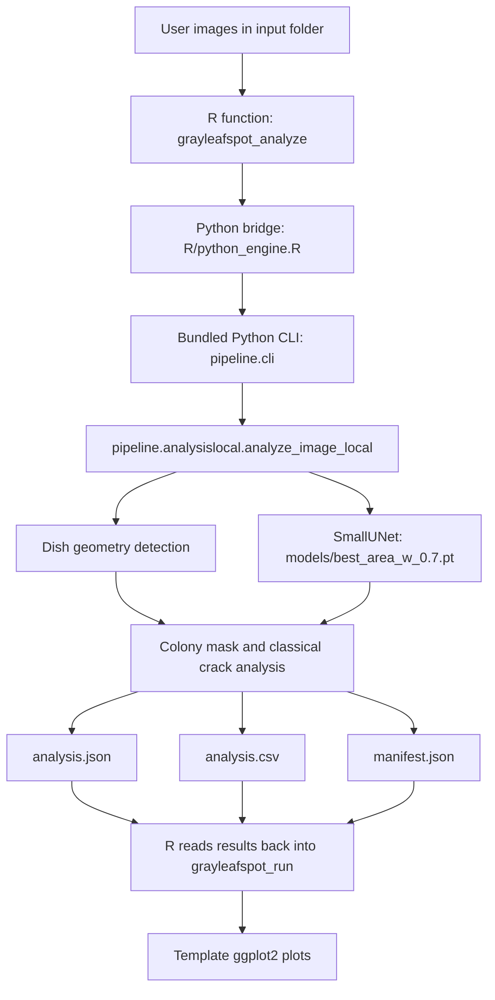

# Gray Leaf Spot for RStudio

`grayleafspotr` is a standalone R package for gray leaf spot analysis that is
used directly from RStudio. The public interface is R, while the analysis
pipeline runs through the bundled Python pipeline.

The package is self-contained inside `grayleafspotr/`. When you open the
project in RStudio, that folder is the working root for the package, example
data, models, notebooks, and outputs.

## Pipeline

The analysis pipeline is `inst/python/pipeline/analysislocal.py`, running
inside `rvenv_arm_311` (ARM64 Python 3.11). The sole model is
`models/best_area_w_0.7.pt` (SmallUNet). No SAM, no Albumentations, no
additional checkpoints are required.

## What This Package Does

- Reads plate images from a folder you choose.
- Runs the bundled Python analysis pipeline from RStudio.
- Uses `models/best_area_w_0.7.pt` (SmallUNet) for segmentation; downloads the
  model automatically from HuggingFace if not present locally.
- Writes raw `analysis.json`, `analysis.csv`, and `manifest.json` files.
- Returns a tidy `grayleafspot_run` object that you can inspect in R.
- Ships built-in `ggplot2` templates you can use as-is or customize.
- Bundles three example plate images in `inst/extdata/testdata/06FEB/` for
  offline testing and vignette examples.

## Package Layout

- `R/` — exported R functions and helpers.
- `inst/python/` — bundled Python pipeline and its requirements.
  - `inst/python/pipeline/analysislocal.py` — SmallUNet pipeline.
  - `inst/python/pipeline/utils.py` — image-processing utilities.
  - `inst/python/requirements_arm.txt` — deps for `rvenv_arm_311`.
- `inst/extdata/example/` — shipped example run (JSON/CSV/manifest).
- `inst/extdata/testdata/06FEB/` — three bundled test images.
- `man/` — Roxygen2-generated documentation for all exported functions.
- `models/` — local model cache (gitignored; auto-downloaded on first use).
- `input_images/` — additional sample images for interactive use (gitignored).
- `notebooks/` — RStudio notebook-style walkthrough.
- `vignettes/` — installed-package vignettes.
- `tests/` — package tests (unit + integration).
- `grayleafspotr.Rproj` — opens the project in RStudio.

## Main Pipeline Flow



## Requirements

Before running the package, make sure you have:

1. R 4.1 or newer.
2. RStudio installed.
3. Python 3.11 (ARM64 via Homebrew) available on your system.
4. A Python environment (`rvenv_arm_311`) with the runtime dependencies from
   `inst/python/requirements_arm.txt`.
5. The model asset for the main pipeline: `models/best_area_w_0.7.pt`.

If you are working from a fresh clone and `models/` is missing, the package
will download the model automatically the first time you call
`grayleafspot_analyze()`. You can also trigger the download explicitly:

```r
grayleafspot_download_model()
```

The model is fetched from
`https://huggingface.co/rotsl/grayleafspot-segmentation` and cached in
`tools::R_user_dir("grayleafspotr", "cache")`.

## Step-by-Step Setup

### 1. Open the package in RStudio

Open `grayleafspotr/grayleafspotr.Rproj` in RStudio. That makes the package
folder the working root.

### 2. Install the R tooling

If `devtools` is not installed yet, install the package dependencies from the
R console:

```r
install.packages(c("devtools", "usethis"))
```

If `devtools` fails because `gert` cannot find `libgit2`, install the system
tooling first from macOS Terminal:

```bash
xcode-select --install
brew install libgit2 pkg-config
```

Then restart RStudio and run the R install command again.

### 3. Create the main Python environment (`rvenv_arm_311`)

This project requires ARM-native Python 3.11 and a version compatible with PyTorch.

Requirements:

- Apple Silicon Mac
- Homebrew installed
- Python 3.11 (ARM64)

1. Verify ARM Python:

```bash
/opt/homebrew/bin/python3.11 -c "import platform; print(platform.machine())"
```

Expected output:

```text
arm64
```

1. Create the virtual environment:

```bash
cd grayleafspotr
/opt/homebrew/bin/python3.11 -m venv rvenv_arm_311
```

1. Activate the environment:

```bash
source rvenv_arm_311/bin/activate
```

1. Upgrade `pip`:

```bash
python -m pip install -U pip
```

1. Install the main pipeline dependencies:

```bash
python -m pip install -r inst/python/requirements_arm.txt
```

1. Verify the installation:

```bash
python -c "import torch; print(torch.__version__)"
```

Expected output:

```text
2.11.0
```

Important notes:

- Do not use `/usr/local/bin/python3.13` — that path runs under Rosetta
  (`x86_64`) and will break PyTorch installation.
- Always use `/opt/homebrew/bin/python3.11`.
- Make sure `platform.machine() == "arm64"`.

Point the package at the interpreter with:

```r
Sys.setenv(GRAYLEAFSPOTR_PYTHON = "/Users/wot25kir/grayleafspot/grayleafspotr/rvenv_arm_311/bin/python")
```

## RStudio Workflow

### Development mode

```r
devtools::load_all()
```

### Installed-package mode

```r
library(grayleafspotr)
```

### Check the Python bridge

```r
grayleafspot_python_available(engine_model = "localunet")
grayleafspot_python_executable(engine_model = "localunet")
```

If `grayleafspot_python_available()` returns `FALSE`, the usual causes are:

- the wrong Python interpreter is selected
- the `rvenv_arm_311` environment is missing packages from
  `inst/python/requirements_arm.txt`
- `models/best_area_w_0.7.pt` is missing

The pinned Python stack for the main pipeline (`rvenv_arm_311`) is:

- `numpy==2.4.4`
- `opencv-python==4.13.0.92`
- `pillow==12.2.0`
- `scipy==1.17.1`
- `scikit-image==0.26.0`
- `torch==2.11.0`
- `torchvision==0.26.0`
- `python-dotenv==1.2.2`

## Running The Package

### Example images

The package accepts any folder of plate images. Common formats include:

- PNG
- JPG / JPEG
- BMP
- TIFF / TIF
- WEBP

When working from this repo, you can use the sample images in:

```text
grayleafspotr/input_images/06FEB
grayleafspotr/input_images/30JAN
```

To analyze your own data, point `input_dir` at your image folder.

### Restarting in a fresh R session

If you restart RStudio, run these lines first so the package uses the correct
Python environment for the main pipeline:

```r
setwd("/Users/wot25kir/grayleafspot/grayleafspotr")
Sys.setenv(GRAYLEAFSPOTR_PYTHON = "/Users/wot25kir/grayleafspot/grayleafspotr/rvenv_arm_311/bin/python")
options(grayleafspotr.python = NULL)
devtools::load_all("/Users/wot25kir/grayleafspot/grayleafspotr")
grayleafspot_python_executable(engine_model = "localunet")
grayleafspot_python_available(engine_model = "localunet")
```

### Run the analysis

```r
run <- grayleafspot_analyze(
  input_dir = "input_images/06FEB",
  output_dir = "outputs",
  filenames = c(
    "20260210_P001_06-FEB_WT_PCBM_SUB_d04_TOP.jpg",
    "20260212_P001_06-FEB_WT_PCBM_SUB_d06_TOP.jpg",
    "20260216_P001_06-FEB_WT_PCBM_SUB_d10_TOP.jpg"
  ),
  save_outputs = TRUE,
  verbose = TRUE,
  engine_model = "localunet"
)
```

What happens:

- R calls the bundled Python pipeline (`analysislocal.py`) using `rvenv_arm_311`.
- The Python code loads the SmallUNet checkpoint from `models/best_area_w_0.7.pt`.
- The pipeline performs dish detection, SmallUNet segmentation, crack analysis,
  and summary metric extraction.
- The run is saved as a timestamped folder under `output_dir`.
- R reads the results back into a `grayleafspot_run` object.

### Reload saved results

After a run completes, reload the saved folder directly if you want to inspect
it again later:

```r
run <- read_grayleafspot_results("outputs/20260427T142731Z_localunet")
run$results[, c("filename", "day", "area_mm2", "diameter_mm", "crack_count", "qc_status")]
```

### Where outputs go

If you set `output_dir = "outputs"`, the package writes a new run folder inside
`grayleafspotr/outputs/` by default.

A saved run contains:

- `analysis.json`
- `analysis.csv`
- `manifest.json`
- `overlays/` with image overlays showing the final mask (red) and crack
  polylines (yellow) on top of each source image

The run folder name is timestamped, for example:

```text
outputs/20260427T120000Z_localunet
```

If you set `save_outputs = FALSE`, the package still returns the run object in
R, but it uses a temporary output location that is cleaned up afterward.

### What the outputs contain

`analysis.json` contains the full structured analysis for each image, including:

- image identifiers
- colony morphology in millimetres and square millimetres
- texture metrics
- crack summaries from the classical crack analysis stage
- radial profile data
- segmentation diagnostics
- overlay image paths

`analysis.csv` contains a tidy, plot-friendly table with the main numeric
results for each image. The measurements are reported in millimetres or
square millimetres rather than pixels.

`manifest.json` records the run metadata:

- pipeline name
- pipeline label
- creation time
- file paths for the saved outputs

## How To Plot Results

The package ships template plots as `ggplot2` objects.

```r
plot_colony_expansion(run)
plot_growth_roughness(run)
plot_stress_remodeling(run)
plot_radial_growth_area(run)
plot_texture_organization(run)
plot_shape_vs_stress(run)
plot_radial_profile(run)
```

Because these functions return `ggplot2` objects, you can customize them:

```r
plot_colony_expansion(run) +
  ggplot2::labs(
    title = "My custom title",
    subtitle = "Custom subtitle"
  )
```

If you want your own plotting workflow, convert the results to tidy data:

```r
df <- as_grayleafspot_growth_data(run)
```

From there you can use `ggplot2`, `dplyr`, `quarto`, or plain R code however
you like.

### Save plots to files

```r
dir.create("outputs/figures", recursive = TRUE, showWarnings = FALSE)

plot_specs <- list(
  colony_expansion = list(fn = plot_colony_expansion, file = "01_colony_expansion.png"),
  growth_roughness = list(fn = plot_growth_roughness, file = "02_growth_roughness.png"),
  stress_remodeling = list(fn = plot_stress_remodeling, file = "03_stress_remodeling.png"),
  radial_growth_area = list(fn = plot_radial_growth_area, file = "04_radial_growth_area.png"),
  texture_organization = list(fn = plot_texture_organization, file = "05_texture_organization.png"),
  shape_vs_stress = list(fn = plot_shape_vs_stress, file = "06_shape_vs_stress.png"),
  radial_profile = list(fn = plot_radial_profile, file = "07_radial_profile.png")
)

for (spec in plot_specs) {
  ggplot2::ggsave(
    filename = file.path("outputs/figures", spec$file),
    plot = spec$fn(run),
    width = 8,
    height = 5,
    dpi = 300
  )
}
```

## Notebook And Vignette

You can follow the same workflow in:

- `notebooks/grayleafspotr_workflow.Rmd` for an RStudio notebook-style
  walkthrough
- `vignettes/grayleafspotr-workflow.Rmd` for the installed package vignette

Both files mirror the same step-by-step sequence:

1. set the package root and point `GRAYLEAFSPOTR_PYTHON` at `rvenv_arm_311/bin/python`
2. clear any saved `grayleafspotr.python` option
3. source the package code or load the installed package
4. confirm the Python bridge works with `engine_model = "localunet"`
5. inspect the example data in `inst/extdata/example/`
6. render the built-in plots from the example run
7. run `grayleafspot_analyze()` with `engine_model = "localunet"` on `input_images/06FEB`
8. reload the saved results from `outputs/<timestamp>_localunet`
9. build and save the plots to `outputs/figures/`
10. inspect the mask overlay PNGs in `outputs/<timestamp>_localunet/overlays/`
11. clean up the `outputs/` folder at the end of the notebook

## Troubleshooting

### `devtools::load_all()` fails

If `devtools` is missing, install it first:

```r
install.packages(c("devtools", "usethis"))
```

If `devtools` fails during install because `gert` cannot find `libgit2`, install
the macOS tools shown above and try again.

### `grayleafspot_python_available()` is `FALSE`

Check these in order:

1. Confirm `grayleafspot_python_executable(engine_model = "localunet")` points
   to `rvenv_arm_311/bin/python`.
2. Reinstall `inst/python/requirements_arm.txt` into `rvenv_arm_311`.
3. Make sure `models/best_area_w_0.7.pt` exists.
4. Restart RStudio and try again.

### `torch` will not install in `rvenv_arm_311`

Make sure you are using `/opt/homebrew/bin/python3.11` (ARM64), not a Rosetta
Python. Verify with:

```bash
/opt/homebrew/bin/python3.11 -c "import platform; print(platform.machine())"
```

## RStudio Notebook

The package includes a notebook-style walkthrough at:

```text
grayleafspotr/notebooks/grayleafspotr_workflow.Rmd
```

### How to run it in RStudio

1. Open `grayleafspotr/grayleafspotr.Rproj`.
2. Open `notebooks/grayleafspotr_workflow.Rmd`.
3. Run the first chunk, which sets:

```r
Sys.setenv(GRAYLEAFSPOTR_PYTHON = file.path(pkg_root, "rvenv_arm_311", "bin", "python"))
options(grayleafspotr.python = NULL)
```

1. Run the example-data chunks first.
1. Run the real-analysis chunk once `grayleafspot_python_available(engine_model = "localunet")` is `TRUE`.
1. Use the saved-run chunk to reload the output folder from `outputs/`.
1. Knit the document or run chunks interactively as needed.

### Notebook inputs and outputs

The notebook uses the sample images in `input_images/06FEB` when the Python ML
dependencies are available.

If the Python stack is not available, it falls back to the shipped example run
so the document still renders cleanly.

The notebook writes analysis outputs to:

```text
grayleafspotr/outputs
```

The `outputs/figures/` subfolder is where the saved PNG plots go.

## Installed Vignette

The package also includes a vignette version of the same walkthrough at:

```text
vignettes/grayleafspotr-workflow.Rmd
```

Use this when you want a packaged, installable reference document rather than
the notebook-style source workflow.

## Development Workflow

This package follows the standard `devtools` workflow:

```r
devtools::load_all()
devtools::document()
devtools::test()
devtools::check()
```

Recommended sequence while developing:

1. Open the `.Rproj` file.
2. Run `devtools::load_all()`.
3. Edit code in `R/`.
4. Re-run the notebook or vignette.
5. Run tests.
6. Run `devtools::check()` before release.

## Main Functions

| Function | Description |
| --- | --- |
| `grayleafspot_analyze()` | Run the SmallUNet pipeline on a folder of images |
| `grayleafspot_python_available()` | Check that the six ML modules are importable |
| `grayleafspot_python_executable()` | Return the resolved Python interpreter path |
| `grayleafspot_download_model()` | Download `best_area_w_0.7.pt` from HuggingFace |
| `read_grayleafspot_results()` | Load a saved run directory into a `grayleafspot_run` |
| `write_grayleafspot_results()` | Serialize results to JSON, CSV, and manifest |
| `as_grayleafspot_growth_data()` | Coerce a run to a tidy data frame |
| `example_grayleafspot_results()` | Load the built-in example run |
| `plot_colony_expansion()` | Colony radius over time |
| `plot_growth_roughness()` | Growth rate and edge roughness |
| `plot_stress_remodeling()` | Crack coverage and count |
| `plot_texture_organization()` | Entropy and center-to-edge delta |
| `plot_shape_vs_stress()` | Eccentricity vs crack coverage scatter |
| `plot_radial_growth_area()` | Radial area by plate (faceted) |
| `plot_feature_heatmap()` | Pearson correlation heatmap |
| `plot_radial_profile()` | Radial intensity profile |

## Example Data

The folder `inst/extdata/example/` contains a tiny example run that you can use
to explore the plotting helpers before running analysis on your own images.

## Quick Start

```r
library(grayleafspotr)
run <- example_grayleafspot_results()
plot_colony_expansion(run)
```

## Release Notes

See `NEWS.md` for the package change log.
