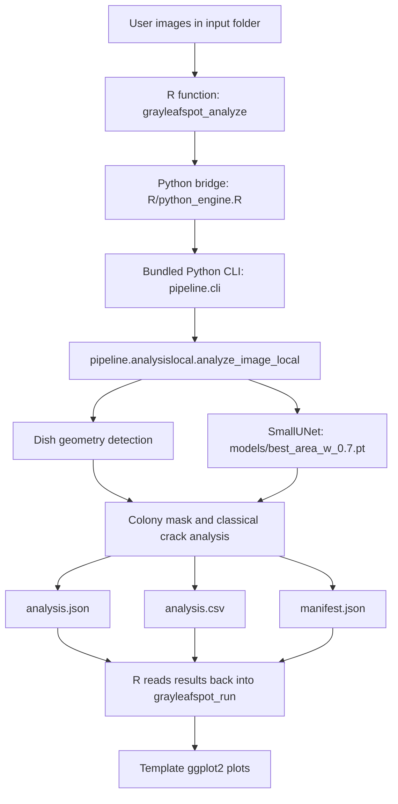

# grayleafspotr 

[](https://rotsl.r-universe.dev/packages)
[](https://rotsl.r-universe.dev/)
[](https://rotsl.r-universe.dev/articles)
[](https://rotsl.r-universe.dev/grayleafspotr)

`grayleafspotr` is an R package for quantitative gray leaf spot analysis. The
public interface is R; the segmentation pipeline runs through a bundled
Python model, managed automatically via `basilisk` so no manual Python setup
is required for normal use.

## Installation

Install the released version from Bioconductor:

```r
if (!requireNamespace("BiocManager", quietly = TRUE))
    install.packages("BiocManager")

BiocManager::install("grayleafspotr")
```

Python dependencies (NumPy, OpenCV, PyTorch, scikit-image, etc.) are
installed automatically by `basilisk` the first time the analysis pipeline is
invoked. This one-time setup may take a few minutes; subsequent calls use the
cached environment. If `basilisk` cannot provision an environment on your
system, see [Manual Python environment setup](#manual-python-environment-setup)
under Development below.

## Quick Start

```r
library(grayleafspotr)

# Explore without running the pipeline
run <- example_grayleafspot_results()
plot_colony_expansion(run)

# Run the pipeline on your own images
res <- grayleafspot_run(
  input_dir  = "path/to/images",
  output_dir = "outputs",
  run_name   = "trial_01"
)
res$results
```

`grayleafspot_run()` finds the bundled Python pipeline automatically, creates
`output_dir` if needed, and returns the parsed JSON results. No manual paths
are required for normal use.

## What This Package Does

- Reads plate images from a folder you choose.
- Runs the bundled Python analysis pipeline (SmallUNet segmentation).
- Downloads the model automatically from HuggingFace if not present locally
  (cached via `BiocFileCache`).
- Writes raw `analysis.json`, `analysis.csv`, and `manifest.json` files.
- Returns a tidy `grayleafspot_run` object that you can inspect in R.
- Ships built-in `ggplot2` templates you can use as-is or customize.
- Overlays detected regions of interest (dish boundary, colony outline,
  cracks) on the source image via `plot_grayleafspot_overlay()`, using
  `EBImage`, so segmentation results can be visually verified.
- Bundles three example plate images in `inst/extdata/testdata/06FEB/` for
  offline testing and vignette examples.

## Package Layout

- `R/` — exported R functions and helpers.
- `inst/python/` — bundled Python pipeline and its requirements.
  - `inst/python/pipeline/analysislocal.py` — SmallUNet pipeline.
  - `inst/python/pipeline/utils.py` — image-processing utilities.
  - `inst/python/requirements_arm.txt` — pinned Python dependency versions.
- `inst/extdata/example/` — shipped example run (JSON/CSV/manifest).
- `inst/extdata/testdata/06FEB/` — three bundled test images.
- `man/` — Roxygen2-generated documentation for all exported functions.
- `models/` — local model cache (gitignored; auto-downloaded on first use).
- `vignettes/` — package vignettes.
- `tests/` — package tests (unit + integration).

## Main Pipeline Flow


```mermaid
flowchart TD
  A["User images in input folder"] --> B["R function: grayleafspot_analyze"]
  B --> C["Python bridge: R/python_engine.R"]
  C --> D["Bundled Python CLI: pipeline.cli"]
  D --> E["pipeline.analysislocal.analyze_image_local"]
  E --> F["Dish geometry detection"]
  E --> G["SmallUNet: models/best_area_w_0.7.pt"]
  F --> H["Colony mask and classical crack analysis"]
  G --> H
  H --> I["analysis.json"]
  H --> J["analysis.csv"]
  H --> K["manifest.json"]
  I --> L["R reads results back into grayleafspot_run"]
  J --> L
  K --> L
  L --> M["Template ggplot2 plots"]
```

## Main Functions

| Function | Description |
| --- | --- |
| `grayleafspot_run()` | **Primary entry point** — run pipeline, return parsed JSON |
| `grayleafspot_analyze()` | Full-featured pipeline returning an S3 `grayleafspot_run` object |
| `grayleafspot_python_available()` | Check that the six ML modules are importable |
| `grayleafspot_python_executable()` | Return the resolved Python interpreter path |
| `grayleafspot_download_model()` | Download `best_area_w_0.7.pt` from HuggingFace via `BiocFileCache` |
| `read_grayleafspot_results()` | Load a saved run directory into a `grayleafspot_run` |
| `write_grayleafspot_results()` | Serialize results to JSON, CSV, and manifest |
| `as_grayleafspot_growth_data()` | Coerce a run to a tidy data frame |
| `example_grayleafspot_results()` | Load the built-in example run |
| `plot_grayleafspot_overlay()` | Overlay detected dish/colony/crack ROIs on the source image (EBImage) |
| `plot_colony_expansion()` | Colony radius over time |
| `plot_growth_roughness()` | Growth rate and edge roughness |
| `plot_stress_remodeling()` | Crack coverage and count |
| `plot_texture_organization()` | Entropy and center-to-edge delta |
| `plot_shape_vs_stress()` | Eccentricity vs crack coverage scatter |
| `plot_radial_growth_area()` | Radial area by plate (faceted) |
| `plot_feature_heatmap()` | Pearson correlation heatmap |
| `plot_radial_profile()` | Radial intensity profile |

## Example Data

The folder `inst/extdata/example/` contains a tiny example run that you can use
to explore the plotting helpers before running analysis on your own images.

## Release Notes

See `NEWS.md` for the package change log.

## Development

The sections below are only needed if you are developing `grayleafspotr`
itself, not for using it as an installed package.

### Requirements

- R (see the minimum version in `DESCRIPTION`).
- A working Python 3 toolchain if you need to bypass `basilisk` (see below).
  `basilisk`'s auto-provisioned environment is normally sufficient and does
  not require you to install Python yourself.
- RStudio is convenient but not required; any R environment works.
- `devtools` and `usethis` for the standard development workflow:

  ```r
  install.packages(c("devtools", "usethis"))
  ```

  If `devtools` fails to install because `gert` cannot find `libgit2`,
  install the system library first (macOS: `brew install libgit2
  pkg-config`; Debian/Ubuntu: `apt install libgit2-dev`) and retry.

### Manual Python environment setup

`basilisk` manages the Python environment automatically for normal use. On
some systems (for example, some Linux setups without a working conda
toolchain, or HPC/cluster environments) `basilisk`'s automatic provisioning
may not succeed. In that case, create the environment yourself and point
`grayleafspotr` at it.

Create the virtual environment **outside** the package directory — putting
it inside the package tree causes RStudio, git, and other tooling that walk
the package directory to crawl the (large) environment on every operation,
which noticeably slows down day-to-day development:

```bash
cd ..   # move outside the grayleafspotr package directory
python3 -m venv rvenv
source rvenv/bin/activate   # Windows: rvenv\Scripts\activate
python -m pip install -U pip
python -m pip install -r grayleafspotr/inst/python/requirements_arm.txt
python -c "import torch; print(torch.__version__)"
deactivate
```

Point the package at the interpreter:

```r
Sys.setenv(GRAYLEAFSPOTR_PYTHON = "/path/to/rvenv/bin/python")
```

A minimum Python version is required for the pinned packages in
`inst/python/requirements_arm.txt` to install; there is no supported
*maximum* Python version. On Apple Silicon, use the native ARM64 Python
(e.g. via Homebrew) rather than a Rosetta/x86_64 build, or PyTorch
installation will fail.

Verify the bridge works:

```r
grayleafspot_python_available(engine_model = "localunet")
grayleafspot_python_executable(engine_model = "localunet")
```

If `grayleafspot_python_available()` returns `FALSE`, check that:

- the correct Python interpreter is selected (`GRAYLEAFSPOTR_PYTHON`, if set),
- the environment has the packages from `inst/python/requirements_arm.txt`,
- `models/best_area_w_0.7.pt` is present or downloadable.

### Development workflow

```r
devtools::load_all()
devtools::document()
devtools::test()
devtools::check()
```

Recommended sequence while developing:

1. Open the `.Rproj` file (or your editor of choice).
2. Run `devtools::load_all()`.
3. Edit code in `R/`.
4. Re-run the vignette.
5. Run tests.
6. Run `devtools::check()` before release.
